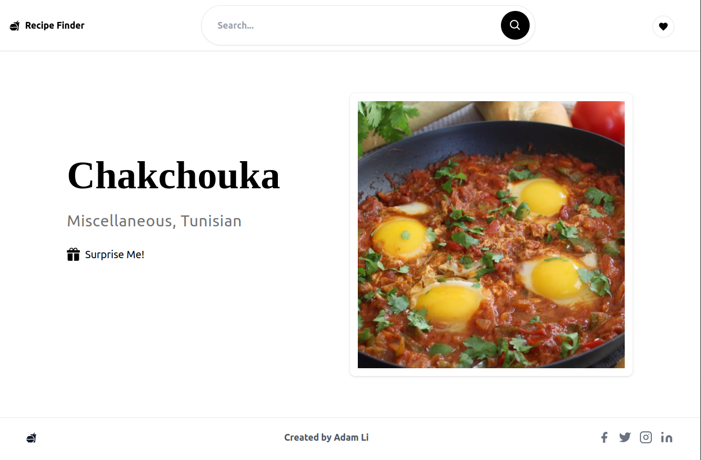
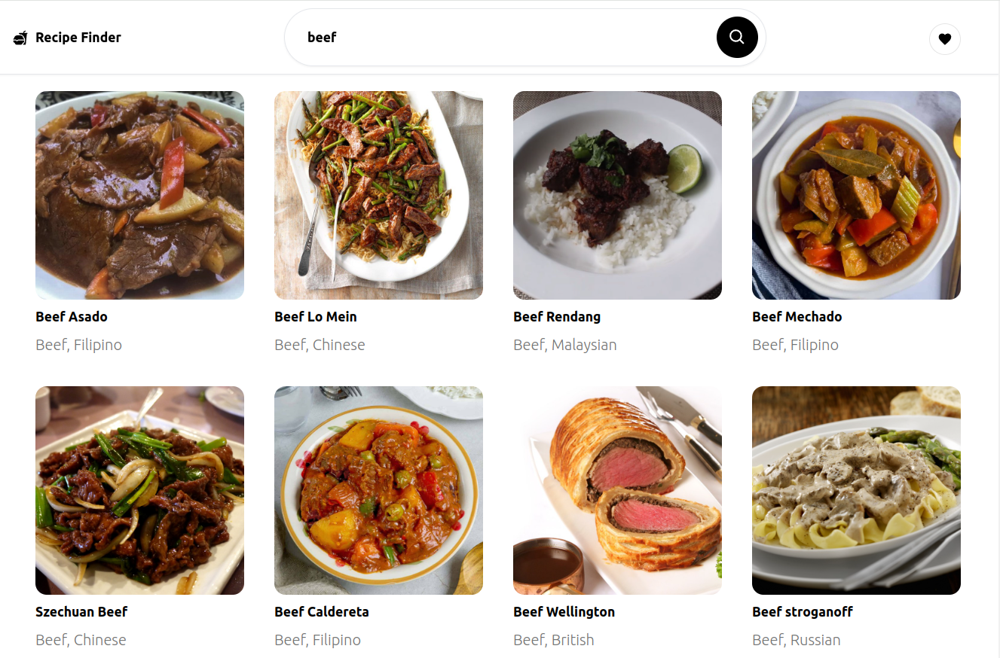
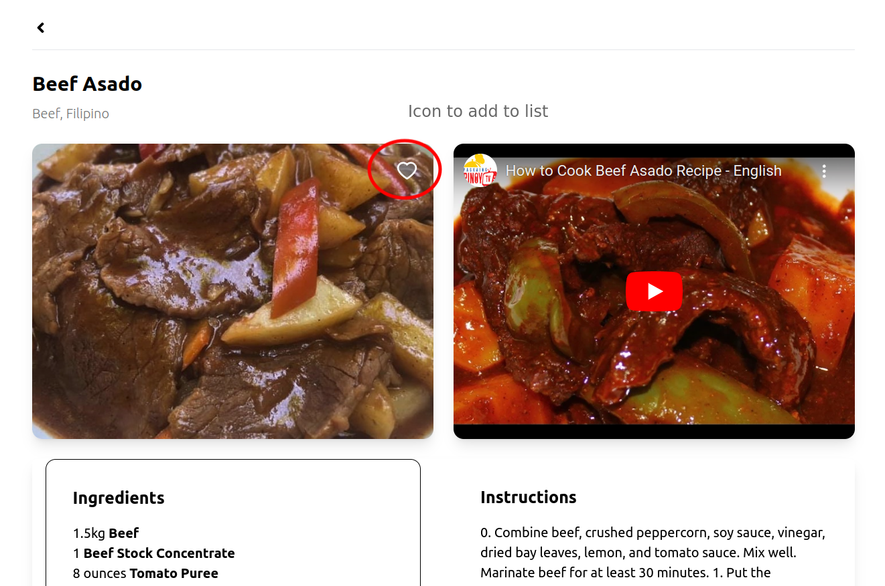
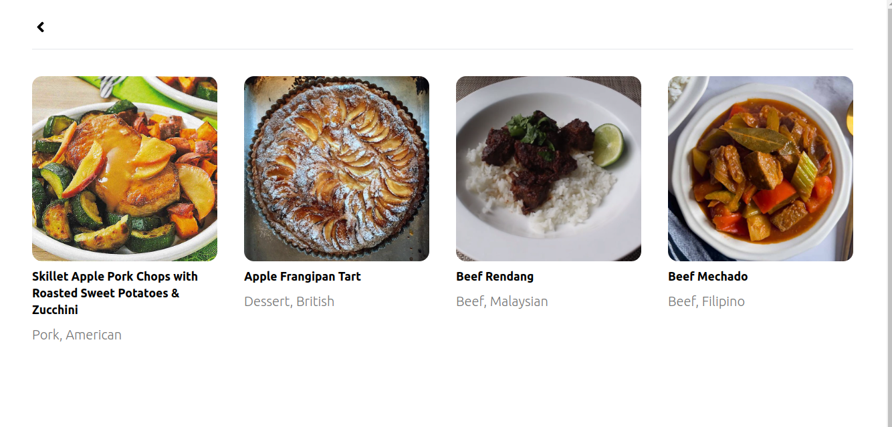

<!--
 * @Author: Adam Li adam@bizzone.com
 * @Date: 2024-12-18 16:32:56
 * @LastEditors: Adam Li
 * @LastEditTime: 2024-12-22 17:26:11
 * @FilePath: /Recipe_Finder/README.md
-->

# Recipe Finder

A React application that interacts with the [TheMealDB API](https://www.themealdb.com/) to search for and display meal recipes. Users can search for meals by name or ingredient, view recipe details, and optionally manage their favorites.


## 🎉 Live Demo
Explore the Recipe Finder in action! Discover your next favorite meal with an easy-to-use interface and vibrant visuals. 

🔗 **[Live Demo](https://recipe-finder-one-murex.vercel.app/)**

✨ **What to Try**:
- Search for "Chicken" to see a variety of chicken-based recipes.
- Explore the recipe details, including cooking instructions and ingredients.
- Save your favorite recipes to revisit later!

---
## Table of Contents

1. [Features](#features)
2. [Screenshots](#screenshots-optional)
3. [Getting Started](#getting-started)
   - [Prerequisites](#prerequisites)
   - [Installation](#installation)
   - [Running the App](#running-the-app)
4. [Usage](#usage)
   - [Search for Meals](#search-for-meals)
   - [View Meal Details](#view-meal-details)
   - [Favorites](#favorites)
   - [Random Meal ](#random-meal)
5. [Project Structure](#project-structure)
6. [Error Handling](#error-handling)


---

## Features

### Search Features

- **Search by Meal Name**: Users can enter a meal name to search for recipes.
- **Search by Ingredient**: Users can search recipes by a specific ingredient.
- **View Recipe Details**: Clicking on a meal displays detailed information, including:
  - Meal name
  - Category and cuisine
  - Instructions
  - Ingredients and measures
  - Meal thumbnail image
  - YouTube video (if available)

### Error Handling Toast

- Displays an error message if the API call fails.
- Handles cases where no meals are found.
- Prevents empty search queries.

### Responsive Design

- Ensures the UI is accessible and looks good on both mobile and desktop devices.

### Favorites List

- Users can add meals to a favorites list in Recipe Details page, stored locally in the browser.

### Random Meal

- A "Surprise Me!" button fetches a random meal.

### Debounced Search

- Reduces the number of API calls while typing.

### Pagination

- For lengthy search results, loads meals in chunks.

---

## Screenshots 
### Home Page and Random Meal 


### Search 


### Detail Page 


### Favorites List

---

## Getting Started

### Prerequisites

- [Node.js](https://nodejs.org/) (version 14+ recommended, use v20.18.0 durning dev)
- [pnpm](https://pnpm.io/) for package management

### Installation

1. **Clone the repository:**
   ```bash
   git clone https://github.com/your-username/recipe-finder.git
   ```
2. **Navigate into the project directory:**
   ```bash
   cd recipe-finder
   ```
2. **Install dependencies using pnpm:** 
   ```bash
   pnpm install
   ```
### Running the App
1. **Start the development server:**
   ```bash
   pnpm run dev
   ```
2. **Open http://localhost:5173 to view the application in your browser.** 


## Usage
### Search for Meals
In the homepage, use the search bar to type a meal name or ingredient.  
Press **Enter** or click the search button.  
A list of matching meals will appear, each displaying a thumbnail and meal name.
### View Meal Details
Click on any meal from the search results.  
A detailed view (or modal) will appear with:  
- Meal name  
- Category and cuisine  
- Instructions  
- Ingredients list and their measures  
- Thumbnail image  
- YouTube video (if available)
### Favorites 
click on the **Heart icon** in deatil page to save a meal to favorite list.  
Favorites are stored locally in `localStorage`, so they persist across sessions.  
Navigate to the **Favorites**  page by click the **Heart icon** at top right of nav bar
### Random Meal 
 **"Surprise Me!"** button click it to fetch a random meal from the API.

## Project Structure
```
recipe-finder/
├── src/
│   ├── components/
│   │   ├── listings
│   │   ├── navbar
│   │   ├── Hero.tsx
│   │   └── ...
│   ├── hooks/
│   │   ├── useFavcorite.ts
│   │   ├── useFetchData.ts
│   │   └── useResponsiveItemsPerPage.ts
│   ├── pages/
│   │   ├── Home.tsx
│   │   ├── FavoritePage.tsx
│   │   └── DetailsPage.tsx
│   ├── routes/
│   │   └── index.tsx
│   ├── type/
│   │   └── SafeRecipe.ts
│   ├── utils/
│   ├── main.tsx
│   └── App.tsx           
├── package.json
├── README.md
└── ...
```
## Error Handling
* Network/Server Errors: Displays a error message if the API call fails.
* No Results: Shows a "No meals found" message when the search yields no data.
* Empty Input: Disables search functionality until a valid query is entered. A toast will appear when query with empty input.